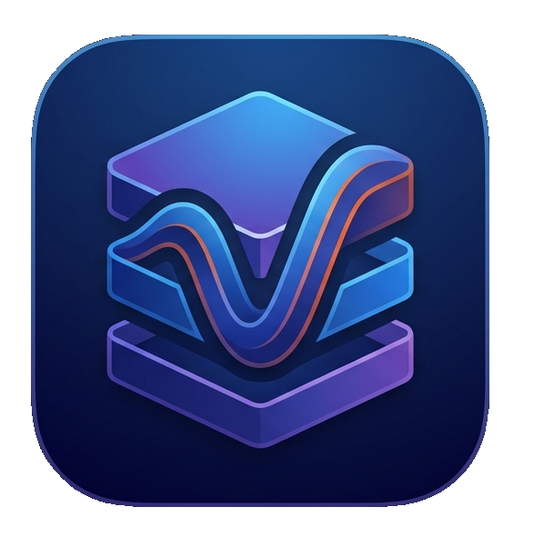
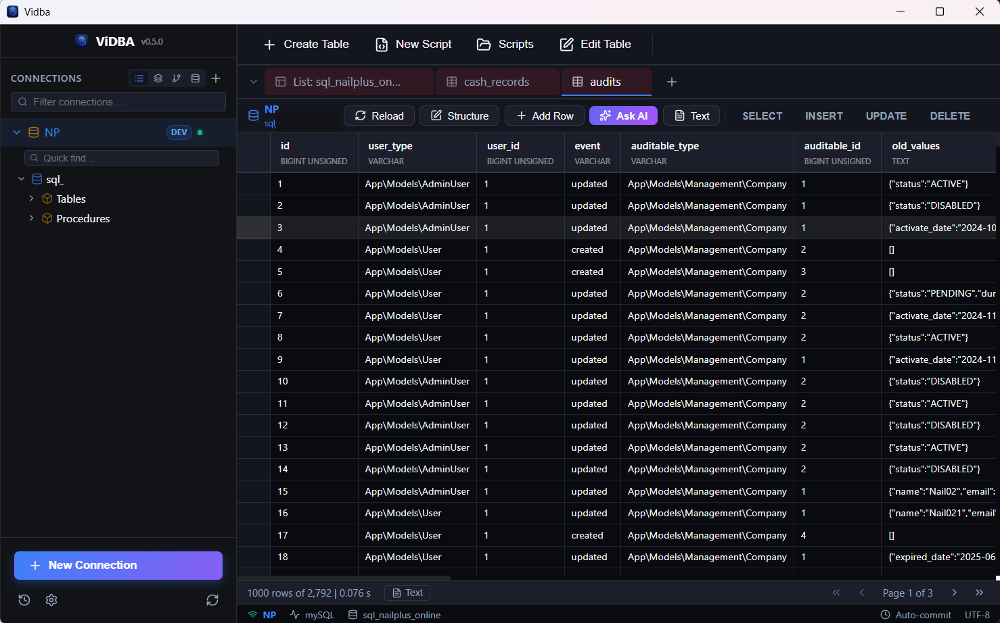
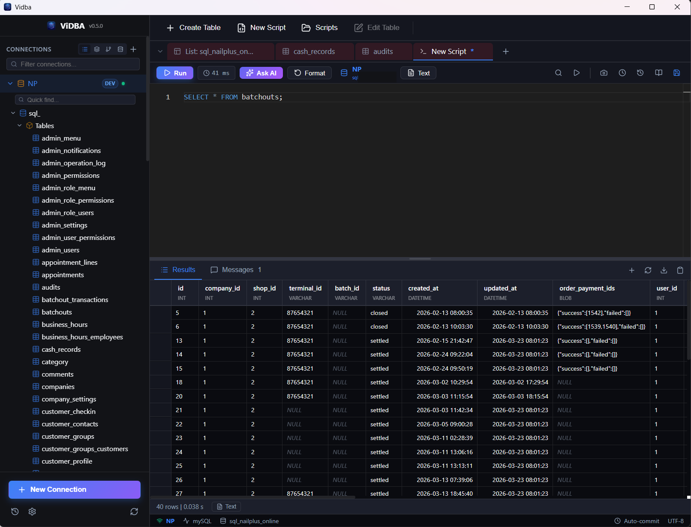
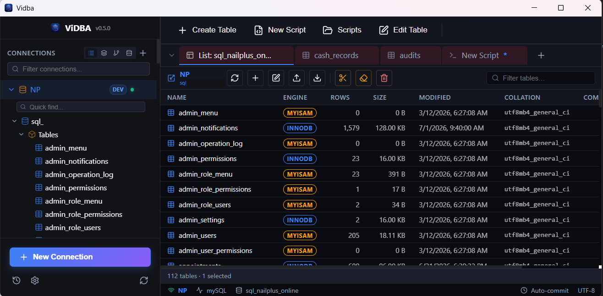

# Vi DB Connect

<p align="center">
  
</p>

<p align="center">
  
  
  
  
  
  
  
  
  
</p>

Vi DB Connect is a lightweight cross-platform desktop database client built with
Tauri 2, Rust, Vue 3, and TypeScript. It is designed for day-to-day database
workflows such as connecting to multiple database engines, browsing schemas,
running SQL, reviewing history, and exporting or importing data.

The project is inspired by tools like DBeaver and Navicat, with a focus on a
small installer size, responsive desktop performance, and a clean modern UI.

## Samples

| Workspace | Query editor | Settings |
| --- | --- | --- |
|  |  |  |

## Features

- Cross-platform desktop app powered by Tauri 2.
- Vue 3 frontend with TypeScript, Pinia, Vue Router, and Monaco Editor.
- Connection management for multiple database types.
- Supported database engines:
  - MySQL
  - PostgreSQL
  - SQL Server
  - SQLite
  - MongoDB
  - Oracle, behind the optional `oracle` Cargo feature. Oracle support is currently beta.
- SQL editor with formatting, snippets, completion helpers, and linting support.
- Query execution with result grids, affected rows, column metadata, and timing.
- Multi-tab workspace for SQL queries, table data, table structure, views, and routines.
- Session restore for tabs and query snapshots.
- Query history and saved result snapshots.
- Import and export workflows, including CSV and spreadsheet-oriented support.
- Schema cache with background synchronization.
- AI-assisted SQL generation with local, integrated, and cloud modes. This feature is currently experimental.
- Separate desktop windows for history, settings, import, and export views.

## Tech Stack

- Backend: Rust, Tauri 2, Tokio, sqlx, tiberius, mongodb, Candle
- Frontend: Vue 3, TypeScript, Vite, Pinia, Vue Router, Monaco Editor
- Packaging: Tauri bundler
- Local storage: SQLite-backed app data for history, snapshots, and schema cache

## Prerequisites

Install the following before running the project:

- Rust toolchain compatible with Rust `1.77.2` or newer
- Node.js and npm
- Tauri 2 system prerequisites for your operating system
- Database client/runtime requirements for the database engines you want to use

For Oracle support, build with the optional `oracle` feature and make sure the
required Oracle client libraries are available on the target machine. Oracle
support is currently beta while driver behavior and packaging requirements are
being stabilized across platforms.

## Development

Run the full desktop app in development mode:

```bash
cargo tauri dev
```

This starts the Vite frontend and launches the Tauri desktop shell.

You can also run the frontend separately for browser-only UI work:

```bash
cd frontend
npm run dev
```

The Vite development server uses port `1424`, with HMR on port `1432`.

## Build

Build the production desktop app and installer:

```bash
cargo tauri build
```

Build only the frontend:

```bash
cd frontend
npm run build
```

Build with Oracle support:

```bash
cargo tauri build --features oracle
```

## Checks and Tests

Frontend type check:

```bash
cd frontend
npx vue-tsc --noEmit
```

Rust checks:

```bash
cargo check -p ViDBA
cargo clippy -p ViDBA
```

Rust tests:

```bash
cargo test -p ViDBA
```

Run a single Rust test:

```bash
cargo test -p ViDBA <test_name>
```

## Architecture

Vi DB Connect follows a layered desktop architecture:

```text
Vue 3 Frontend (frontend/src)
    <-> Tauri IPC commands and events
Tauri Command Handlers (src-tauri/src/commands.rs)
    <->
Rust Managers
    <->
Database Abstraction Layer
    <->
Database Drivers
```

### Frontend

The frontend starts at `frontend/src/main.ts`, registers Pinia and Vue Router,
and mounts the application through `App.vue`.

Important frontend areas:

- `frontend/src/views` contains the main workspace and secondary window views.
- `frontend/src/components` contains layout, editor, result grid, settings, and UI components.
- `frontend/src/stores/connections.ts` manages saved connections and connection state.
- `frontend/src/stores/tabs.ts` manages workspace tabs.
- `frontend/src/stores/query.ts` handles query execution state and result caching.
- `frontend/src/stores/session.ts` restores tabs and snapshots between app launches.
- `frontend/src/stores/ui.ts` handles theme, toast messages, dialogs, and UI state.

### Backend

The Rust backend starts in `src-tauri/src/lib.rs`, where Tauri state managers and
command handlers are registered.

Important backend areas:

- `src-tauri/src/commands.rs` exposes Tauri IPC commands to the frontend.
- `src-tauri/src/db_manager.rs` manages active database connections and routes queries.
- `src-tauri/src/db/mod.rs` defines the shared async database trait.
- `src-tauri/src/db/*` implements database-specific drivers.
- `src-tauri/src/history_manager.rs` persists query history and result snapshots.
- `src-tauri/src/db/schema_cache_manager.rs` manages cached schema metadata.
- `src-tauri/src/ai/ai_manager.rs` coordinates AI SQL generation modes.
- `src-tauri/src/settings_manager.rs` and `src-tauri/src/config_manager.rs` manage local configuration.

## AI SQL Generation

<p>
  
</p>

AI-assisted SQL generation is coordinated by the Rust backend and can run in
three modes:

- Built-in: local inference using Candle-compatible model files.
- Integrated: local service integration, such as Ollama over HTTP.
- Cloud: external API providers such as OpenAI, Grok, or Gemini.

Schema context is compacted before it is sent to a model so prompts stay within
the available context window. This feature is experimental: prompts, provider
settings, local model support, and generated SQL quality may change between
releases.

<!--
## Donate

If Vi DB Connect helps your workflow, donations and sponsorships are welcome.

Donation links have not been configured in this repository yet. Maintainers can
add links here, for example:

- GitHub Sponsors: `https://github.com/sponsors/<your-name>`
- Ko-fi: `https://ko-fi.com/<your-name>`
- Buy Me a Coffee: `https://www.buymeacoffee.com/<your-name>`
- PayPal: `https://paypal.me/<your-name>`
-->

## License

No project license has been selected yet.

Until a `LICENSE` file is added and the `license` field in
`src-tauri/Cargo.toml` is updated, this repository should be treated as
copyrighted with all rights reserved. That means the source is visible, but no
explicit permission has been granted for redistribution, modification, or
commercial use.

Before publishing or accepting external contributions, choose a license and add
it to the repository. Common choices include MIT, Apache-2.0, GPL-3.0, and
AGPL-3.0, depending on the intended distribution and contribution model.
